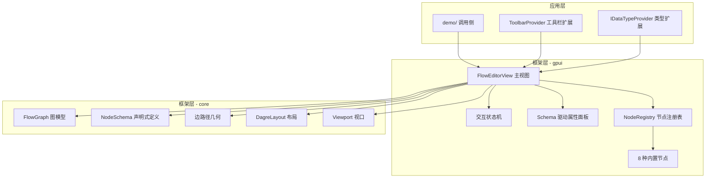

# 什么是 rust-agent-flow

## 一句话定义

**rust-agent-flow** 是一个框架无关的可视化流程图设计组件库，以 **GPUI** 为渲染层、**策略模式** 为节点扩展机制，提供**图灵完备的控制流节点**（Start/End/Action/Condition/Loop/Variable/Adapter/Agent），让 Rust 开发者在桌面应用中嵌入一个类 ReactFlow 的流程设计器，而无需重新发明布局算法与边路径几何。

## 解决的核心痛点

在传统 GPUI 应用中构建流程设计器，常见路径是：

```
自建图数据结构 → 手写节点渲染 → 拼装布局 → 调试连线 → 重复造轮子
```

每一步都需要架构决策，团队难以形成统一规范。rust-agent-flow 将这些**横切关注点内聚到框架层**：

| 痛点 | rust-agent-flow 的解法 |
|------|------------------------|
| 图数据结构不稳定 | `FlowGraph` 基于 slotmap 稳定键，增删不失效 |
| 布局算法难写 | `DagreLayout` 包装 dagre（ReactFlow 同款 Sugiyama 算法） |
| 边路径几何复杂 | 移植 ReactFlow 的 Bezier/Step/SmoothStep 算法 |
| 端口连线端点错位 | `resolve_endpoints` 智能推导 Auto 方向 + 同侧端口分布 |
| 节点类型硬编码 | `IFlowNode` 策略模式 + `NodeRegistry` 按 kind 匹配 |
| 属性面板重复 | `FieldSpec` 驱动自动生成编辑界面 |
| 扩展能力不足 | trait + `Arc<dyn>` + setter 注入（Toolbar/DataType/Syntax） |

## 产品形态：可嵌入的流程设计器

使用 rust-agent-flow 构建的应用，天然具备以下**产品级形态**：



一个典型的入口 `main.rs` 只有二十几行：

```rust
use std::sync::Arc;
use rust_agent_flow_gpui::{CombinedAssets, FlowEditorView, SharedToolbarProvider};

fn main() {
    gpui_platform::application()
        .with_assets(CombinedAssets)
        .run(move |cx: &mut gpui::App| {
            rust_agent_flow_gpui::init(cx);
            cx.spawn(async move |cx| {
                cx.open_window(gpui::WindowOptions::default(), |window, cx| {
                    let graph = load_my_flow(); // 你的流程图
                    let view = cx.new(|cx| {
                        let mut editor = FlowEditorView::new(graph, cx);
                        editor.auto_layout(cx);          // dagre 自动排版
                        editor.add_toolbar_provider(
                            Arc::new(MyToolbar::new()),    // 注入工具栏扩展
                            cx,
                        );
                        editor
                    });
                    cx.new(|cx| gpui_component::Root::new(view, window, cx))
                }).expect("Failed to open window");
            }).detach();
        });
}
```

其余一切——节点渲染、连线绘制、布局重排、属性面板、命中测试——由框架在 `render` 时自动完成。

## 核心能力一览

### 1. 图灵完备控制流

八种内置节点覆盖全部控制流需求：

- **顺序**：Start（起点）→ Action（步骤）→ End（终点）
- **分支**：Condition（条件判断，多路出口 + else 兜底）
- **循环**：Loop（for_each / while / for_loop / batch_parallel，回环边）
- **辅助**：Variable（变量定义）、Adapter（数据适配）、Agent（智能体）

### 2. ReactFlow 风格的边路径

边路径算法直接移植自 ReactFlow 的 `@xyflow/xyflow`：

```rust
use rust_agent_flow::{bezier_path, smoothstep_path, straight_path, step_path};

// 四种边类型 + 循环回环 U 形路由
let pts = smoothstep_path(src, dst, PortSide::Right, PortSide::Left, 8.0);
```

### 3. Schema 驱动的属性面板

声明 `FieldSpec`，面板自动生成对应编辑控件（Text/Code/Dropdown/List/Switch），消除 per-kind 面板分发：

```rust
NodeSchema::new("action", "Action")
    .with_field(FieldSpec::new("label", "Label", FieldType::Text))
    .with_field(FieldSpec::new("code", "Code", FieldType::CodeBlock))
```

### 4. trait 注入扩展体系

三个扩展点统一采用 `trait + Arc<dyn Trait> + setter 注入` 模式：

- `ToolbarProvider`：自定义工具栏按钮
- `IDataTypeProvider`：自定义复杂数据类型
- `SyntaxService`：自定义语法高亮

## 框架边界：它不是什么

明确边界能避免误用：

- **不是** 全功能 GUI 框架——基于 GPUI，需在 GPUI 应用中嵌入
- **不是** 流程执行引擎——只负责**设计时**的可视化编辑，运行时执行由你实现
- **不是** Web 端方案——GPUI 是桌面框架，不支持浏览器
- **不适合** 只需静态展示流程图（无交互编辑）的场景——直接用 SVG 更轻量

## 与生态中其他方案的定位

| 方案 | 定位 | rust-agent-flow 的差异 |
|------|------|------------------------|
| ReactFlow | Web 端流程编辑器 | rust-agent-flow 是其 Rust/GPUI 桌面对应物 |
| dagre（独立库） | 仅布局算法 | rust-agent-flow 集成 dagre + 边路径 + 交互 + 面板 |
| 手写 GPUI 画布 | 自由组合 | rust-agent-flow 提供完整设计器骨架与约定 |

## 小结

rust-agent-flow 的产品形态是：**一个框架无关、类型安全、扩展点清晰的 GPUI 流程设计器组件库**。你专注于业务节点定义与工具栏扩展，框架负责图模型、布局、边路径、交互与属性面板。

下一节：[适用场景与边界](who-should-use.md)
