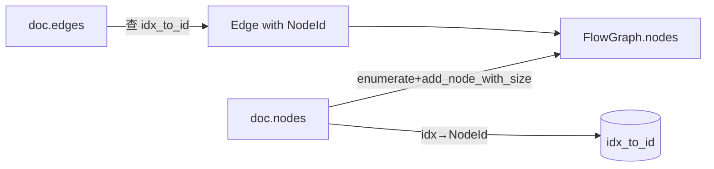
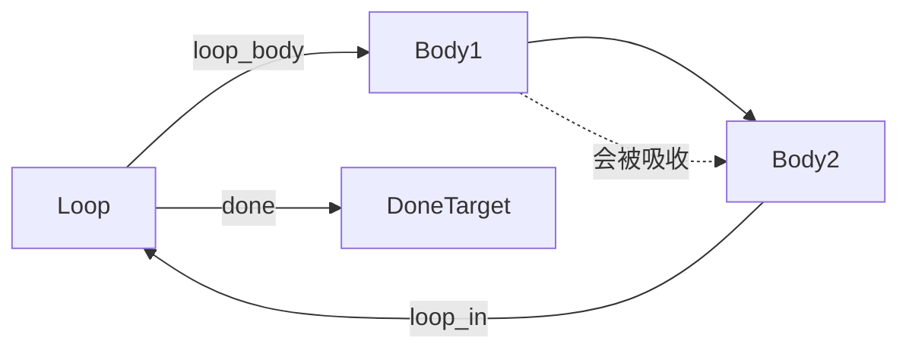

# FlowDocument 互转

`FlowDocument` 是流程图的序列化协议（JSON），与运行时的 `FlowGraph` 通过 `from_document` / `to_document` 双向互转。两者分工明确：`FlowGraph` 用 slotmap 稳定键便于运行时操作与缓存，`FlowDocument` 用数组索引便于序列化与跨语言消费。

## 为什么要两个模型

| 维度 | FlowGraph（运行时） | FlowDocument（序列化） |
|------|---------------------|------------------------|
| 节点引用 | `NodeId`（slotmap 键，含内部版本号） | `usize`（数组下标） |
| 序列化稳定 | 否（slotmap 键跨进程不稳定） | 是（索引即数组位置） |
| 边引用 | `NodeId` | `usize` 节点索引 |
| 用途 | 渲染、命中测试、布局 | 持久化、网络传输、跨语言 |

slotmap 的键编码了「槽位 + 版本号」，序列化后语义不可移植；而数组索引天然稳定且可被任何 JSON 解析器消费。因此框架在边界做一次转换：进入运行时用 `from_document`，离开用 `to_document`。

## from_document：文档转图

```rust
pub fn from_document(doc: &FlowDocument) -> Self {
    let mut graph = Self::new();
    let mut idx_to_id: HashMap<usize, NodeId> = HashMap::new();

    for (idx, node_def) in doc.nodes.iter().enumerate() {
        let size = node_def.size
            .unwrap_or_else(|| SizeF::new(180.0, 64.0)); // 默认 180×64
        let node_id = graph.add_node_with_size(
            node_def.kind.clone(),
            node_def.data.clone(),
            size,
        );
        if let Some(pos) = node_def.position {
            if let Some(n) = graph.node_mut(node_id) {
                n.position = pos;
            }
        }
        idx_to_id.insert(idx, node_id);
    }

    for edge_def in &doc.edges {
        let source = match idx_to_id.get(&edge_def.source) { Some(id) => *id, None => continue };
        let target = match idx_to_id.get(&edge_def.target) { Some(id) => *id, None => continue };
        let mut edge = Edge::new(source, target);
        edge.source_port = edge_def.source_port.clone();
        edge.target_port = edge_def.target_port.clone();
        if let Some(et) = edge_def.edge_type { edge.edge_type = et; }
        graph.add_edge(edge);
    }
    graph
}
```

转换规则要点：

| 字段 | None 时的处理 |
|------|---------------|
| `NodeDef.size` | 用通用默认 `180×64`（gpui 层 `sync_node_sizes` 会修正） |
| `NodeDef.position` | 保持 `PointF::zero()`，由布局引擎计算 |
| `EdgeDef.edge_type` | 用 `Edge::default()` 的 `Bezier` |
| `EdgeDef.source_port` / `target_port` | 保持 `None`，框架自动推导 |
| 引用了不存在索引的边 | 静默跳过（`continue`），保证文档部分损坏也能加载 |

### 索引映射的核心

`idx_to_id: HashMap<usize, NodeId>` 是转换的枢纽：文档中节点用 `usize` 索引引用，图里用 `NodeId` 引用。边在第二阶段循环里查这张表把索引翻译为 `NodeId`。



## to_document：图转文档

```rust
pub fn to_document(&self, name: impl Into<String>) -> FlowDocument {
    let mut doc = FlowDocument::new(name);
    let mut id_to_idx: HashMap<NodeId, usize> = HashMap::new();

    for (idx, node) in self.nodes.values().enumerate() {
        id_to_idx.insert(node.id, idx);
        doc.nodes.push(NodeDef {
            kind: node.kind.clone(),
            data: node.data.clone(),
            size: Some(node.size),          // 始终写出
            position: Some(node.position),  // 始终写出
        });
    }

    for edge in self.edges.values() {
        let source = match id_to_idx.get(&edge.source) { Some(i) => *i, None => continue };
        let target = match id_to_idx.get(&edge.target) { Some(i) => *i, None => continue };
        doc.edges.push(EdgeDef {
            source, target,
            source_port: edge.source_port.clone(),
            target_port: edge.target_port.clone(),
            edge_type: Some(edge.edge_type),
        });
    }
    doc
}
```

与 `from_document` 对称，但有两点不同：

1. **节点顺序由 slotmap 内部顺序决定**——导出顺序不一定与原始文档一致，但边的索引引用会正确对应，逻辑等价。
2. **size/position 始终写出**（`Some`），不丢失布局结果。下次 `from_document` 加载时可恢复精确位置。

## loop_body_groups：循环体分组

`loop_body_groups()` 是循环渲染的唯一数据源。它收集每个 Loop 节点（`loop_body` 出边的源）及其循环体节点集合：

```rust
pub fn loop_body_groups(&self) -> HashMap<NodeId, HashSet<NodeId>> {
    // Step 1: 找所有 loop_body 出边，按 Loop 节点分组
    // Step 2: BFS 沿前向边展开，排除三类边：
    //   - loop_in 回环边（target_port == "loop_in"）
    //   - 回到 Loop 节点本身的边（如 done）
    //   - done 目标节点（防止吸收出口节点）
}
```

### BFS 排除规则



| 边类型 | 处理 | 原因 |
|--------|------|------|
| `loop_body` 出边 | 种子节点 | 循环体入口 |
| 普通前向边 | 继续展开 | 循环体内部流转 |
| `target_port == "loop_in"` | 跳过 | 回环边，不展开 |
| 目标是 Loop 节点本身 | 跳过 | 防止回到循环头 |
| `done` 目标节点 | 跳过 | 出口节点不属于循环体 |

### 为什么是唯一数据源

`loop_body_groups` 同时被两处消费：

| 消费方 | 用途 |
|--------|------|
| dagre 后处理 `reserve_loop_back_edge_space` | 为回环边预留下方空间 |
| dagre 后处理 `align_loop_body_target` | 把循环体摆到 Loop 右侧 |
| 渲染层 `cached_body_groups` | 隐藏/收起循环体、回环边路由边界计算 |

在 `relayout` 末尾缓存一次，避免渲染层每帧重复 O(V+E) BFS 遍历。图结构变化触发 `relayout` → 重算 `loop_body_groups` → 更新缓存，这是单一数据源原则的体现。

## 完整往返示例

```rust
// 构建文档
let mut doc = FlowDocument::new("demo");
let a = doc.add_node(NodeDef::new("start", json!({"label": "开始"})));
let b = doc.add_node(NodeDef::new("end",   json!({"label": "结束"})));
doc.add_edge(EdgeDef::new(a, b));

// 文档 → 图（运行时）
let mut graph = FlowGraph::from_document(&doc);

// 编辑图：插入一个 Action 节点
let c = graph.add_node("action", json!({"label": "处理"}));

// 图 → 文档（持久化）
let doc2 = graph.to_document("demo-edited");
let json = serde_json::to_string_pretty(&doc2).unwrap();
```

往返过程保证：`from_document(to_document(g))` 与 `g` 在**逻辑结构**上等价（节点 kind/data、边连接关系、端口引用一致），slotmap 键的具体值不保证相同——这正是设计意图。

## 小结

`FlowDocument` 用数组索引替代 slotmap 键实现序列化稳定性。`from_document`/`to_document` 通过 `idx_to_id`/`id_to_idx` 映射表完成引用翻译，对损坏文档采用静默跳过策略保证健壮性。`loop_body_groups` 是循环体渲染的唯一数据源，在 `relayout` 末尾缓存，被布局后处理与渲染层共同消费。

下一节：[NodeSchema 与 PortSpec](../06-schema-system/node-schema-port.md)
