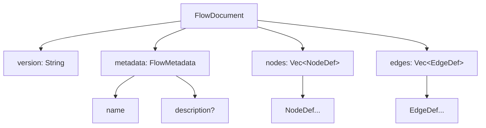
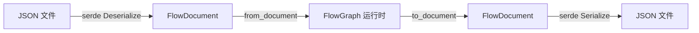

# FlowDocument 序列化协议

`FlowDocument` 是流程图的 JSON 序列化协议，也是框架与外界（文件系统、网络、其他语言）交换流程定义的唯一格式。第五章已介绍它与 `FlowGraph` 的互转，本节聚焦协议本身的字段语义与 JSON 结构。

## 协议顶层结构

```rust
pub struct FlowDocument {
    pub version: String,        // 协议版本（当前 "1.0"）
    pub metadata: FlowMetadata, // 流程元数据
    pub nodes: Vec<NodeDef>,    // 节点定义列表
    pub edges: Vec<EdgeDef>,    // 边定义列表（用节点索引引用）
}
```



`version` 是协议版本号（区别于 `FlowGraph.version` 那个缓存计数器）。当前固定 `"1.0"`，未来若协议发生不兼容变更（如重命名字段），通过它做版本路由。

## FlowMetadata：元数据

```rust
pub struct FlowMetadata {
    pub name: String,             // 流程名称
    pub description: Option<String>, // 流程描述（可选）
}
```

```rust
impl FlowDocument {
    pub fn new(name) -> Self { /* version="1.0", description=None, 空 nodes/edges */ }
    pub fn with_description(mut self, desc) -> Self { ... }
}
```

元数据用于文件名建议、流程列表展示、文档说明，不参与布局或渲染逻辑。

## NodeDef：节点定义

```rust
pub struct NodeDef {
    pub kind: String,                    // 匹配 IFlowNode::kind
    pub data: serde_json::Value,         // 业务数据
    pub size: Option<SizeF>,             // None → 用 schema.default_size
    pub position: Option<PointF>,        // None → 由布局引擎计算
}
```

| 字段 | 序列化默认 | 含义 |
|------|-----------|------|
| `kind` | 必填 | 节点类型，决定 schema 与 `IFlowNode` 实现 |
| `data` | 必填 | 业务数据，结构由 `NodeSchema.fields` 约束 |
| `size` | `null` | 节点尺寸，`null` 时由 schema 兜底 |
| `position` | `null` | 节点位置，`null` 时由 dagre 计算 |

构建器：

```rust
NodeDef::new("action", json!({"label":"处理","code":""}))
    .with_size(SizeF::new(200.0, 80.0))
    .with_position(PointF::new(100.0, 50.0))
```

> `size`/`position` 都设计为 `Option`，是因为序列化场景下「未指定」与「指定为零尺寸/零坐标」语义不同：未指定让框架兜底，指定则尊重用户布局。

## EdgeDef：边定义

```rust
pub struct EdgeDef {
    pub source: usize,                  // 源节点在 nodes 数组中的下标
    pub target: usize,                  // 目标节点下标
    pub source_port: Option<String>,    // 源端口 ID（None → 自动推导）
    pub target_port: Option<String>,    // 目标端口 ID
    pub edge_type: Option<EdgeType>,    // 边类型（None → Bezier 默认）
}
```

**关键设计：用 `usize` 索引引用节点，而非 slotmap 键**。这是序列化稳定性的根基——数组下标天然可移植，slotmap 键含内部版本号不可跨进程。

构建器：

```rust
EdgeDef::new(0, 1)                            // nodes[0] → nodes[1]
    .with_source_port("if_0")
    .with_target_port("in")
    .with_edge_type(EdgeType::SmoothStep)
```

## 完整 JSON 示例

一个 Start → Action → End 的最小流程：

```json
{
  "version": "1.0",
  "metadata": {
    "name": "hello-flow",
    "description": "最小示例"
  },
  "nodes": [
    { "kind": "start",  "data": { "label": "开始" }, "size": null, "position": null },
    { "kind": "action", "data": { "label": "处理", "code": "x = 1" },
      "size": { "w": 180.0, "h": 64.0 }, "position": { "x": 100.0, "y": 0.0 } },
    { "kind": "end",    "data": { "label": "结束" }, "size": null, "position": null }
  ],
  "edges": [
    { "source": 0, "target": 1, "source_port": null, "target_port": null, "edge_type": null },
    { "source": 1, "target": 2, "source_port": null, "target_port": null, "edge_type": "Bezier" }
  ]
}
```

### 结构化节点的边

Condition 的多分支边通过 `source_port` 区分：

```json
{
  "nodes": [
    { "kind": "condition", "data": { "conditions": [
        {"name":"分支1","expr":"x>0","desc":""},
        {"name":"else","expr":"","desc":""}
    ]}, "size": null, "position": null },
    { "kind": "action", "data": {}, "size": null, "position": null },
    { "kind": "action", "data": {}, "size": null, "position": null }
  ],
  "edges": [
    { "source": 0, "target": 1, "source_port": "if_0", "target_port": null, "edge_type": "SmoothStep" },
    { "source": 0, "target": 2, "source_port": "else", "target_port": null, "edge_type": "SmoothStep" }
  ]
}
```

Loop 的回环边用 `target_port: "loop_in"` + 渲染层置 `EdgeKind::LoopBack`（注意 `EdgeDef` 不直接存 `EdgeKind`，由渲染层根据 `loop_in` 端口推断）：

```json
{ "source": 2, "target": 0, "source_port": null, "target_port": "loop_in", "edge_type": "SmoothStep" }
```

## 构建文档的 API

```rust
impl FlowDocument {
    pub fn new(name) -> Self;
    pub fn with_description(self, desc) -> Self;
    pub fn add_node(&mut self, node: NodeDef) -> usize; // 返回索引供边引用
    pub fn add_edge(&mut self, edge: EdgeDef);
}
```

`add_node` 返回索引是关键设计——边需要用这个索引引用节点：

```rust
let mut doc = FlowDocument::new("demo").with_description("示例");
let start = doc.add_node(NodeDef::new("start", json!({"label":"开始"})));
let end   = doc.add_node(NodeDef::new("end",   json!({"label":"结束"})));
doc.add_edge(EdgeDef::new(start, end));
```

## 协议设计要点小结

| 设计 | 选择 | 原因 |
|------|------|------|
| 节点引用 | `usize` 数组索引 | 序列化稳定，跨语言可消费 |
| `size`/`position` | `Option` | 区分「未指定」与「显式零值」 |
| `edge_type` | `Option<EdgeType>` | `None` 时用默认 Bezier |
| `source_port`/`target_port` | `Option<String>` | `None` 时框架自动推导 |
| `EdgeKind` | 不存入文档 | 由渲染层根据 `loop_in` 端口推断，减少冗余 |
| `version` | 字符串 | 未来协议演进做版本路由 |

## 与 FlowGraph 的关系回顾



往返保证逻辑结构等价（kind/data/边连接/端口引用），slotmap 键的具体值不保证相同——这是刻意的：运行时键是内存态实现细节，不应泄漏到序列化协议。

## 小结

`FlowDocument` = `version` + `metadata` + `nodes` + `edges`，节点用数组索引引用保证序列化稳定。`Option` 字段区分「未指定」与「显式值」，让框架能在「用户布局」与「自动布局」间切换。`EdgeKind` 不入文档，由渲染层按 `loop_in` 端口推断，减少冗余。这是框架与外界交换流程定义的唯一协议。

下一节：[边路径算法](../07-geometry-layout/edge-path-algorithms.md)
