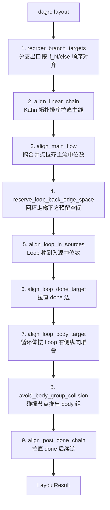

# Dagre 布局引擎

dagre 是 rust-agent-flow 的自动布局核心，基于 Sugiyama 分层布局算法。框架包装了 `dagre` crate（dagre.js 的完整 Rust 移植，与 ReactFlow 官方示例同源），并在其结果上叠加 9 步后处理管线以适配控制流节点的语义。

## LayoutEngine 抽象

布局能力用 trait 抽象，便于未来替换实现：

```rust
pub enum LayoutDirection { Vertical, Horizontal }  // TB / LR

pub struct LayoutResult {
    pub positions: HashMap<NodeId, PointF>,
}

pub trait LayoutEngine: Send + Sync {
    fn layout(&self, graph: &FlowGraph, direction: LayoutDirection) -> LayoutResult;
}
```

`Send + Sync` 约束保证布局引擎可跨线程使用（虽然当前都是同步调用）。`LayoutResult` 只含位置，尺寸仍由 `node.size` 携带——布局引擎读尺寸但不修改它。

## DagreLayout 配置

```rust
pub struct DagreLayout {
    nodesep: f64,  // 同层节点间距，默认 40
    ranksep: f64,  // 层间距，默认 80
}
```

```rust
let layout = DagreLayout::new()
    .with_nodesep(40.0)
    .with_ranksep(80.0);
```

## layout 主流程

```rust
impl LayoutEngine for DagreLayout {
    fn layout(&self, graph, direction) -> LayoutResult {
        let rankdir = match direction { Vertical => TB, Horizontal => LR };
        // 1. 构建 dagre 图：节点用稳定索引字符串作 id
        // 2. 给边赋 weight/minlen 引导布局
        // 3. 调用 dagre layout
        // 4. 中心坐标转左上角坐标
        // 5. 9 步后处理
    }
}
```

### 节点映射

slotmap 键不能直接给 dagre（它要字符串 id），因此用枚举索引作稳定 id：

```rust
for (i, node) in graph.nodes().enumerate() {
    let key = i.to_string();
    id_map.insert(node.id, key.clone());
    g.set_node(key, NodeLabel { width, height, .. });
}
```

### 边的 weight/minlen 策略

这是适配控制流语义的关键。不同端口语义的边赋不同权重，引导 dagre 的破环与分层：

```rust
let (weight, minlen) = match edge.source_port.as_deref() {
    Some("loop_body") => (100, 1),  // 高权重，避免反转
    Some("done")      => (100, 2),  // 高权重 + minlen=2，强制 done 目标到第 2 层
    Some("loop_in")   => (1, 1),    // 低权重，dagre 倾向反转它破环
    _                 => (1, 1),
};
```

| 端口 | weight | minlen | 目的 |
|------|--------|--------|------|
| `loop_body` | 100 | 1 | 保持前向，循环体在 Loop 下一层 |
| `done` | 100 | 2 | done 目标强制到第 2 层（循环体之下），防止挤入回环 U 形区域 |
| `loop_in` | 1 | 1 | 低权重让 dagre 反转它破环，不干扰主流 |
| 普通边 | 1 | 1 | 默认 |

dagre 用 NetworkSimplex ranker 求解分层，高权重边倾向不被反转，低权重边倾向被反转——这套权重让循环图被「正确」地破环：回环边反转，主流保持前向。

### 坐标转换

dagre 返回节点**中心**坐标，框架转成左上角（`Node.position` 的语义）：

```rust
positions.insert(node_id, PointF::new(
    (x - label.width * 0.5) as f32,
    (y - label.height * 0.5) as f32,
));
```

## 9 步后处理管线

dagre 的原始结果对通用 DAG 友好，但对控制流语义（分支顺序、循环体收起、回环空间）不够精确。框架在 dagre 结果上叠加 9 步后处理，**顺序敏感**：



| 步骤 | 模块 | 作用 |
|------|------|------|
| 1 | `branch` | Condition 的 `if_N`/`else` 出口按声明顺序重排，分支标签与目标位置对应 |
| 2 | `linear` | 用 Kahn 拓扑排序拉直无分支主线，避免 dagre 偶发的交错 |
| 3 | `main_flow` | 跨合并点拉齐主流节点到中位数中心线（补 `align_linear_chain` 在合并点断链的不足） |
| 4 | `loop_layout` | Loop 底部以下的非 body/非 done 节点下移 `BACK_EDGE_RESERVE`，给 U 形回环留空间 |
| 5 | `loop_layout` | Loop 节点移到 `loop_in` 入源的中位数 Y，回环边视觉对称 |
| 6 | `loop_layout` | done 目标对齐到 Loop 的 done 端口高度，拉直 done 边 |
| 7 | `loop_layout` | 循环体节点摆到 Loop 右侧，纵向堆叠（与下方回环路由配套） |
| 8 | `loop_layout` | 检测非 body 节点与 body 组包围盒的重叠，右移碰撞节点到 body 组右侧 |
| 9 | `loop_layout` | done 目标之后的直线链路对齐，避免后续节点错位 |

步骤 3（`align_main_flow`）必须在 `align_linear_chain`（步骤 2）之后——前者拉直简单链后，后者用已对齐节点的中位数把跨合并点的主流节点拉回同一中心线；必须在 `reserve_loop_back_edge_space`（步骤 4）之前——确保 Loop 及其后续节点在预留空间前已在主流线上。步骤 4 必须在 5 之前——回环空间预留位移源节点后，步骤 5 才能将 Loop 对齐到最终位置。步骤 5 必须在 6/7 之前——因为它会移动 Loop 节点位置，6/7 据新位置调整。步骤 8 在 body 摆位（步骤7）之后运行，用最终 body 位置计算碰撞检测。`loop_body_groups` 在管线开始前计算一次，供步骤 4/7/8 复用，避免重复 BFS。

### Loop 区域三层空间模型

Loop 节点在画布上占用三层空间，由后处理管线的步骤 4-8 分别负责：

| 层 | 空间 | 负责步骤 | 说明 |
|---|------|---------|------|
| L1 | Loop 节点自身 | dagre 布局 + 步骤 5 | dagre 按 rank 放置，步骤 5 调 cross-axis 对齐入源 |
| L2 | Body Group 区域 | 步骤 7 + 步骤 8 | 步骤 7 将 body 节点纵向堆叠在 Loop 右侧；步骤 8 检测并推开与 body 组包围盒重叠的其他节点 |
| L3 | Back-edge 走廊 | 步骤 4 | Loop 底部以下区域，供 `loop_back_path` 的 U 形回环路由使用 |

```
横向布局示意图：

  ┌─────────┐ L1
  │  Loop   │═══════════┐ L2 (body group)
  └────┬────┘           │     ┌─────────┐
       │                ├════>│ Process │ (纵向堆叠)
       │                │     └────┬────┘
       │                │          │
  ═════╧════════════════╧══════════╧════ L3 (back-edge corridor)
  ←───────── loop_back_path U 形路由 ─────────→
```

**设计要点**：
- L3 的走廊预留（步骤4）在 Loop 对齐（步骤5）之前运行，确保 Loop 对齐到位移后的源节点位置
- L2 的碰撞检测（步骤8）在 body 摆位（步骤7）之后运行，用最终 body 位置计算碰撞
- `done_target` 在步骤 4 中被排除，保护步骤 6 的 done 对齐不被破坏

### 模块稳定性分级

| 模块 | 稳定性 | 原因 |
|------|--------|------|
| `branch` | 稳定 | 纯算法，与端口语义弱耦合 |
| `linear` | 稳定 | Kahn 拓扑排序，通用 |
| `main_flow` | 稳定 | 中位数对齐，补 `linear` 在合并点断链的不足 |
| `loop_layout` | 易变 | 紧耦合 Loop 端口语义与渲染层端口位置 |

`loop_layout` 单独隔离，使 Loop 布局策略调整不干扰稳定算法。常量如 `LOOP_NODE_MID_Y=40`（必须匹配 gpui 层 `node.size.h/2`，其中 `node.size.h = TITLE_H + BODY_H = 80`）在此模块内声明，因为 core 不能依赖 gpui。

## relayout 集成

gpui 层 `FlowEditorView::relayout` 是布局入口：

```rust
fn relayout(&mut self) {
    self.sync_node_sizes();                    // 同步渲染尺寸到 node.size
    let dir = /* Horizontal => LR, Vertical => TB */;
    let result = DagreLayout::new().layout(&self.graph, dir);
    for (node_id, pos) in &result.positions {
        if let Some(node) = self.graph.node_mut(*node_id) {
            node.position = *pos;
        }
    }
    self.cached_body_groups = self.graph.loop_body_groups();  // 缓存循环体
    // ... 派生 cached_all_body_nodes / cached_hidden_nodes
}
```

**为什么 sync_node_sizes 必须先跑**：结构化节点（Condition）高度随条件项数量变化，但 `node.size.h` 可能在创建后未更新。dagre 用 `node.size` 算分层与间距，尺寸错误会导致层间距错乱、回环边边界计算错误。`sync_node_sizes` 在布局前同步真实渲染尺寸。

## 后处理的性能取舍

9 步后处理都是 O(V+E) 级别的局部调整，相对 dagre 本身的 NetworkSimplex 求解开销可忽略。它们只在 `relayout` 时跑一次，结果写入 `node.position` 后被渲染层缓存——拖拽、平移等交互不触发重排。

属性面板编辑结构化字段时，`update_node_size_if_changed` 单节点检查：只有尺寸真正变化（如增删条件项导致高度变）才触发 `relayout`，普通文本编辑不触发——这是性能优化的关键路径。

## 小结

`DagreLayout` 包装 dagre crate（Sugiyama 算法），用 weight/minlen 策略引导破环：`loop_body`/`done` 高权重保持前向，`loop_in` 低权重被反转。dagre 返回中心坐标需转左上角。9 步后处理管线（顺序敏感）适配控制流语义：分支对齐、主线拉直、主流跨合并点对齐、循环体右侧堆叠、body 组碰撞避让、回环走廊预留。`loop_layout` 模块单独隔离因其紧耦合 Loop 语义。`relayout` 前 `sync_node_sizes` 保证 dagre 用准确尺寸。

下一节：[Viewport 视口数学](viewport.md)
