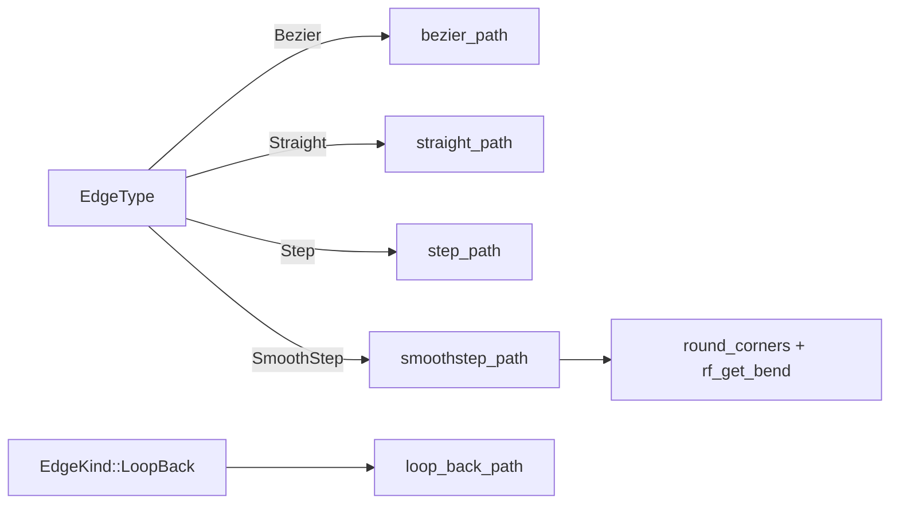

# 边路径算法

边路径算法把「两端点 + 两侧方向」转换成可绘制的折线/曲线点序列，全部位于 `crates/core/src/geometry/edge_path.rs`。这套算法直接移植自 ReactFlow `@xyflow/xyflow`，保证视觉效果与业界标准一致。所有函数返回 `Vec<PointF>`，供 gpui 层的 Canvas 渲染器消费。

## 算法总览

| 函数 | 点数 | 用途 |
|------|------|------|
| `straight_path` | 2 | 直线 |
| `bezier_path` | 4（P0,ctrl1,ctrl2,P3） | 三次贝塞尔（默认） |
| `step_path` | 折线 | 正交直角 |
| `smoothstep_path` | 圆角折线 | 正交圆角 |
| `loop_back_path` | 5 | 循环回环 U 形 |
| `round_corners` | 通用圆角 | 给任意折线加圆角 |



## Straight：直线

```rust
pub fn straight_path(src: PointF, dst: PointF) -> Vec<PointF> {
    vec![src, dst]
}
```

最简单的实现，2 点直线。不依赖 side 方向。

## Bezier：三次贝塞尔

```rust
pub fn bezier_path(
    src: PointF, dst: PointF,
    src_side: PortSide, dst_side: PortSide,
    curvature: f32,
) -> Vec<PointF> {
    let ctrl1 = bezier_control(src, dst, src_side, true, curvature);
    let ctrl2 = bezier_control(dst, src, dst_side, false, curvature);
    vec![src, ctrl1, ctrl2, dst]
}
```

返回 `[P0, ctrl1, ctrl2, P3]`，每个控制点沿其端点的 side 外法向偏移。偏移量由 `control_offset` 计算（移植自 ReactFlow `calculateControlOffset`）：

```rust
fn control_offset(distance: f32, curvature: f32) -> f32 {
    if distance >= 0.0 {
        0.5 * distance                       // 正常连接：取距离一半
    } else {
        curvature * 25.0 * (-distance).sqrt() // 反向连接：防塌缩
    }
}
```

### 反向连接的防塌缩

正常连接（目标在前方）时控制点偏移取距离一半，曲线自然弯曲。但当目标在源的后方（如源 Right 出、目标在源左侧），`distance < 0`，若仍用 `0.5*distance` 会得到负偏移，控制点反向，曲线塌缩成直线甚至打结。

`curvature * 25 * sqrt(-distance)` 用平方根增长保证反向时仍有正向偏移，且随距离缓慢增长——这是 ReactFlow 多年调参的经验公式，`curvature` 典型值 `0.25`。

```
正常连接 (distance>0)：        反向连接 (distance<0)：
  src ──→ ctrl1 ──→            src ←── dst
                  ╲              ╲    ╱
                   ╲              ctrl（正向偏移）
                    dst
```

## Step：正交直角

```rust
pub fn step_path(src, dst, src_side, dst_side) -> Vec<PointF> {
    rf_get_points(src, src_side, dst, dst_side, 20.0) // offset=20
}
```

移植自 ReactFlow `getPoints()`，用 `offset=20` 把端点先沿外法向延伸 20px 形成弯折空间，再正交路由。处理三类情况：

| 情况 | 路由 |
|------|------|
| 对向 side（Right→Left） | S 曲线，2 个中点弯折 |
| 同向 side（Right→Right） | L 形或调整 |
| 混合 side（Right→Bottom） | 经过一个角点的 L 形 |

`rf_get_points` 内部用 `rf_direction` 判断主路由轴（X 或 Y），再据 src/dst 外法向在主轴的分量选弯折点位置，最后组装 `[src, gapped_src, ...mid_points, gapped_dst, dst]`。

## SmoothStep：正交圆角

```rust
pub fn smoothstep_path(
    src, dst, src_side, dst_side, border_radius: f32,
) -> Vec<PointF> {
    let raw = rf_get_points(src, src_side, dst, dst_side, 20.0);
    round_corners(&raw, border_radius)
}
```

先走 `rf_get_points` 得到直角折线，再用 `round_corners` 把每个内部角点替换为二次贝塞尔采样点。

### round_corners：通用圆角

```rust
pub fn round_corners(points: &[PointF], border_radius: f32) -> Vec<PointF> {
    if points.len() < 3 || border_radius <= 0.0 { return points.to_vec(); }
    let mut result = Vec::with_capacity(points.len() * 10);
    result.push(points[0]);
    for i in 1..points.len() - 1 {
        let bend_pts = rf_get_bend(points[i-1], points[i], points[i+1], border_radius);
        result.extend_from_slice(&bend_pts);
    }
    result.push(*points.last().unwrap());
    result
}
```

- 折线少于 3 点或 `border_radius <= 0` 时原样返回
- 首尾点严格保留
- 每个内部角点用 `rf_get_bend` 采样成圆弧

### rf_get_bend：二次贝塞尔采样

`rf_get_bend(a, b, c, size)` 把尖角 `a→b→c` 替换为圆弧：

- 控制点固定在角点 `b`（对应 SVG `Q` 命令）
- 圆弧从 `b` 沿 `a→b` 方向退 `bend_size` 开始，到沿 `b→c` 方向进 `bend_size` 结束
- `bend_size = size.min(d_ab*0.5).min(d_bc*0.5)`，不超过相邻段长一半
- 共线时直接返回 `[b]`（无需圆角）
- 每个圆弧采样 `SAMPLES=8` 个点

```
原始折线：           圆角后：
a ──── b            a ──╮
       │                ╲  (8 个采样点)
       │                 ╲
       c                  ── c
```

之所以采样成点序列而非保留 SVG 命令，是因为 gpui 的 Canvas 渲染器消费的是折线点，不直接支持 SVG `Q`。`SAMPLES=8` 是视觉平滑度与点数的平衡点。

## LoopBack：循环回环 U 形

`loop_back_path` 是 Loop 节点回环边的专用算法，生成 5 点 U 形路径，始终从循环体下方绕回：

```rust
pub fn loop_back_path(
    src: PointF, dst: PointF,
    _horizontal: bool,
    node_bounds: RectF,
) -> Vec<PointF> {
    let approach_offset = 30.0;
    let bottom_margin = 40.0;
    let bottom_y = node_bounds.bottom().max(src.y) + bottom_margin;
    let approach_x = dst.x - approach_offset;
    vec![
        src,
        PointF::new(src.x, bottom_y),       // 下出
        PointF::new(approach_x, bottom_y),  // 左移
        PointF::new(approach_x, dst.y),     // 上移
        dst,                                 // 右进
    ]
}
```

路由方向固定为 **DOWN → LEFT → UP → RIGHT**：

```
   src ●
        ╲
         ╲ (下出)
          ●─────────────● (bottom_y，左移)
                        │
                        │ (上移)
                        ● → ● dst (右进)
```

关键参数：

| 参数 | 值 | 含义 |
|------|-----|------|
| `approach_offset` | 30 | 终点前的水平偏移，需 > `border_radius(12) + arrow_size(8)`，保证圆角后还有足够直线段放箭头 |
| `bottom_margin` | 40 | 路径在节点底部下方的留白 |
| `bottom_y` | `max(node_bounds.bottom, src.y) + 40` | 取节点底部与源点下方的较大者，保证路径绕过所有障碍 |

`_horizontal` 参数保留为 API 兼容，但**两种布局方向都走相同的下方路由算法**——这简化了渲染层逻辑，且与 `align_loop_body_target`（循环体始终摆 Loop 右侧纵向堆叠）一致。

`node_bounds` 应包含 Loop 节点 + 全部循环体节点的联合包围盒，使路径能绕过整组节点。这由布局后处理 `reserve_loop_back_edge_space` 预留空间保证。

## 算法选择策略

| 场景 | 推荐 EdgeType | 原因 |
|------|--------------|------|
| 默认连线 | Bezier | 自然流畅，ReactFlow 默认 |
| 严格结构化流程图 | SmoothStep | 正交圆角，可读性强 |
| 简洁直连 | Straight | 两点一线 |
| 老式正交 | Step | 直角无圆角 |
| 循环回环 | SmoothStep + EdgeKind::LoopBack | U 形路由 + 圆角 |

回环边通常配 `EdgeType::SmoothStep`：先走 `loop_back_path` 得 5 点折线，再 `round_corners` 圆角，得到圆滑的 U 形回环。

## 小结

五种路径算法覆盖全部连线需求。`bezier_path` 的 `control_offset` 用平方根公式防反向塌缩；`step`/`smoothstep` 共用 ReactFlow 的 `rf_get_points` 路由，后者额外用 `rf_get_bend`（二次贝塞尔采样 `SAMPLES=8`）圆角；`round_corners` 是通用折线圆角函数；`loop_back_path` 用 5 点 U 形（DOWN→LEFT→UP→RIGHT）处理回环，`approach_offset=30` 保证箭头空间。所有算法零 GPUI 依赖，纯数学计算。

下一节：[端口端点计算](port-calc.md)
