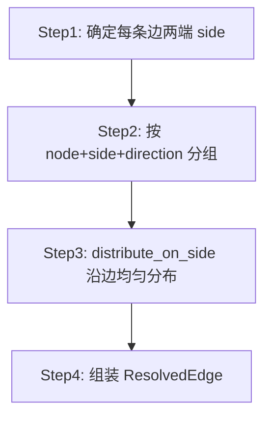

# 端口端点计算

边路径算法需要每条边两端的精确坐标与方向（side）。`resolve_endpoints` 把图里「Node + 可选端口」的抽象引用解析成 `ResolvedEdge { src, src_side, dst, dst_side }`，是边渲染的前置步骤。它解决两个核心问题：Auto side 的方向推导、同侧多端口的均匀分布。

## resolve_endpoints 总览

```rust
pub fn resolve_endpoints<F>(
    graph: &FlowGraph,
    port_specs: F,  // Fn(NodeId) -> Vec<PortSpec>
) -> HashMap<EdgeId, ResolvedEdge>
where F: Fn(NodeId) -> Vec<PortSpec>
```

`port_specs` 是闭包，gpui 层从 `NodeRegistry` 提供——它返回某节点的 schema 端口声明，用于尊重固定 side 与知道端口方向。

`ResolvedEdge` 携带两端点坐标与 side：

```rust
pub struct ResolvedEdge {
    pub src: PointF,
    pub src_side: PortSide,
    pub dst: PointF,
    pub dst_side: PortSide,
}
```

## 四步流程



### Step 1：确定每条边两端 side

```rust
let src_side = resolve_side(edge.source_port.as_deref(), &src_specs, src_node, dst_node);
let dst_side = resolve_side(edge.target_port.as_deref(), &dst_specs, dst_node, src_node);
```

`resolve_side` 优先用 schema 声明的固定 side，否则用 `compute_side_from_position` 推导：

```rust
fn resolve_side(port_id, specs, self_node, other_node) -> PortSide {
    if let Some(id) = port_id {
        if let Some(spec) = specs.iter().find(|s| s.id == id) {
            if spec.side != PortSide::Auto { return spec.side; } // 固定 side
        }
    }
    compute_side_from_position(self_node.center(), other_node.center()) // Auto
}
```

### compute_side_from_position：Auto 方向推导

```rust
fn compute_side_from_position(self_center, other_center) -> PortSide {
    let dx = other_center.x - self_center.x;
    let dy = other_center.y - self_center.y;
    if dx.abs() >= dy.abs() {
        if dx >= 0.0 { PortSide::Right } else { PortSide::Left }
    } else if dy >= 0.0 { PortSide::Bottom } else { PortSide::Top }
}
```

比较 `dx`/`dy` 绝对值，取大者所在轴：水平轴主导则选 Left/Right，垂直轴主导则选 Top/Bottom。这是「对端在哪个方向就选那个方向的边」的直观策略。

```
对端在右下方 (dx>dy)：         对端在正上方 (|dy|>|dx|)：
  self → Right                  self → Top
       ╲                             │
        other                        other
```

### Step 2：按 (node, side, direction) 分组

```rust
let mut slots: HashMap<(NodeId, PortSide, PortDirection), Vec<(EdgeId, bool)>> = HashMap::new();
for edge in graph.edges() {
    slots.entry((edge.source, src_side, PortDirection::Out)).or_default().push((edge.id, true));
    slots.entry((edge.target, dst_side, PortDirection::In)).or_default().push((edge.id, false));
}
```

把所有边端点按「节点 + 所在 side + 入/出方向」分桶。同一桶里的端口要在同一条边上均匀分布。

### Step 3：distribute_on_side 沿边均匀分布

```rust
fn distribute_on_side(bounds, side, dir, has_opposite, count) -> Vec<PointF> {
    let (start, end) = if has_opposite {
        match dir {
            PortDirection::In  => (0.5, 1.0),  // In 占下半
            PortDirection::Out => (0.0, 0.5),  // Out 占上半
        }
    } else { (0.0, 1.0) };
    // 在 [start, end] 区间均匀分 count 个点
}
```

**关键：In/Out 同侧分区**。当某个 (node, side) 同时有 In 和 Out 端口时（如节点右侧既有入边又有出边），两者各占半边避免重叠：

```
同侧有 In+Out：               同侧只有 Out：
┌─────────┐ ← Out 上半        ┌─────────┐
│         │ ● out1            │         │ ● out1
│         │ ● out2            │         │ ● out2
│  node   │ ─── 分界          │  node   │ ● out3
│         │ ● in1             │         │
│         │ ● in2             │         │
└─────────┘ ← In 下半          └─────────┘
```

`has_opposite` 预先计算哪些 (node, side) 同时有 In 和 Out，避免在分布循环里重复查表。

分布点的参数化：`count>1` 时第一个点在 `start + step*0.5`（居中），步长 `(end-start)/count`；`count==1` 时取中点 `(start+end)/2`。

### point_on_side：边上的绝对坐标

```rust
fn point_on_side(bounds, side, t, outward) -> PointF {
    // t ∈ [0,1] 沿 side 参数化位置
    // outward=2.0 像素外移，避免边压在节点边界上
}
```

`outward=2.0` 把端口端点向外推 2 像素，让连线视觉上「接出」节点边界而非压在边上。每个 side 的参数化方向：

| side | 参数轴 | t=0 → t=1 |
|------|--------|-----------|
| Top | X | 左 → 右 |
| Right | Y | 上 → 下 |
| Bottom | X | 左 → 右 |
| Left | Y | 上 → 下 |
| Auto | — | 取 right + center.y 兜底 |

### Step 4：组装 ResolvedEdge

```rust
for edge in graph.edges() {
    let src = positions.get(&(edge.id, true)).copied()
        .unwrap_or_else(|| src_node.center());  // 兜底用节点中心
    let dst = positions.get(&(edge.id, false)).copied()
        .unwrap_or_else(|| dst_node.center());
    result.insert(edge.id, ResolvedEdge { src, src_side, dst, dst_side });
}
```

兜底逻辑：若某端点未进入分布槽（如节点无端口声明且 side 推导失败），用节点中心点，保证总能产出合法坐标，不 panic。

## 分布顺序的稳定性

Step 3 中 `entries.sort_by_key(|(_, is_src)| *is_src)` 把同槽内的边按「是否为源」排序——源端点（`is_src=true`）排前，目标端点排后。这保证分布点的分配顺序稳定，避免同一边在多次 `resolve_endpoints` 调用间端点位置跳变（否则视觉上边会「跳」）。

## 与边路径算法的衔接

`resolve_endpoints` 输出的 `ResolvedEdge` 直接喂给边路径算法：

```rust
let resolved = resolve_endpoints(&graph, |id| registry.specs(id));
for edge in graph.edges() {
    let r = resolved[&edge.id];
    let points = match edge.edge_type {
        EdgeType::Bezier => bezier_path(r.src, r.dst, r.src_side, r.dst_side, 0.25),
        EdgeType::Straight => straight_path(r.src, r.dst),
        EdgeType::Step => step_path(r.src, r.dst, r.src_side, r.dst_side),
        EdgeType::SmoothStep => smoothstep_path(r.src, r.dst, r.src_side, r.dst_side, 8.0),
    };
    // 渲染 points...
}
```

回环边（`EdgeKind::LoopBack`）走 `loop_back_path`，传入循环体联合包围盒作为 `node_bounds`。

## 何时调用

`resolve_endpoints` 是 O(E) 遍历 + 哈希分桶，开销与边数线性相关。渲染层在 `relayout` 后缓存结果，图结构变化（`version` 变）时重算——拖拽、平移等不改结构的交互复用缓存。

## 小结

`resolve_endpoints` 四步：确定 side → 分组 → 分布 → 组装。Auto side 用 `compute_side_from_position` 按 `dx`/`dy` 绝对值选轴；同侧 In/Out 用半边分区避免重叠；`outward=2` 像素外移让连线视觉接出节点。分布顺序按 `is_src` 排序保证稳定。输出 `ResolvedEdge` 直接喂边路径算法，缓存随 `version` 失效。

下一节：[Dagre 布局引擎](dagre-layout.md)
