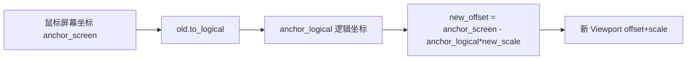

# Viewport 视口数学

`Viewport` 是画布的平移与缩放状态，定义逻辑坐标（文档坐标）与屏幕坐标（像素坐标）之间的双向变换。它是一个纯数学结构，零 GPUI 依赖，所有渲染层在绘制前用它把逻辑坐标转屏幕坐标。

## 数据结构

```rust
pub struct Viewport {
    pub offset: PointF, // 屏幕空间下逻辑原点的位置（平移）
    pub scale: f32,     // 缩放因子（1.0 = 100%）
}

impl Default for Viewport {
    fn default() -> Self { Self { offset: PointF::zero(), scale: 1.0 } }
}

impl Viewport {
    pub const MIN_SCALE: f32 = 0.2;
    pub const MAX_SCALE: f32 = 3.0;
}
```

| 字段 | 含义 | 默认 |
|------|------|------|
| `offset` | 逻辑原点 (0,0) 在屏幕上的位置 | (0,0) |
| `scale` | 1 逻辑单位对应多少屏幕像素 | 1.0 |

`offset` 不是「相机偏移」而是「逻辑原点的屏幕坐标」——这两个视角等价但前者更易推导变换公式。

## 双向变换

```rust
/// Logical → screen: screen = logical * scale + offset
pub fn to_screen(self, logical: PointF) -> PointF {
    PointF::new(
        logical.x * self.scale + self.offset.x,
        logical.y * self.scale + self.offset.y,
    )
}

/// Screen → logical: logical = (screen - offset) / scale
pub fn to_logical(self, screen: PointF) -> PointF {
    PointF::new(
        (screen.x - self.offset.x) / self.scale,
        (screen.y - self.offset.y) / self.scale,
    )
}
```

两者互逆：`to_logical(to_screen(p)) == p`。

```
逻辑空间                屏幕空间
 (0,0) ──────→  offset
                │
逻辑 (Lx,Ly) ──→ (Lx*scale+off.x, Ly*scale+off.y)
```

| 变换 | 公式 | 用途 |
|------|------|------|
| `to_screen` | `logical * scale + offset` | 绘制：逻辑坐标 → 屏幕坐标 |
| `to_logical` | `(screen - offset) / scale` | 命中测试：鼠标屏幕坐标 → 逻辑坐标 |

渲染时所有节点/边坐标先 `to_screen` 转屏幕坐标再绘制；鼠标事件先把屏幕坐标 `to_logical` 转逻辑坐标再做命中测试——这使命中测试代码无需感知视口状态。

## 缩放限制

```rust
pub fn clamp_scale(scale: f32) -> f32 {
    scale.clamp(Self::MIN_SCALE, Self::MAX_SCALE)
}
```

| 常量 | 值 | 含义 |
|------|-----|------|
| `MIN_SCALE` | 0.2 | 最小缩放（缩到 20%） |
| `MAX_SCALE` | 3.0 | 最大缩放（放到 300%） |

限制缩放范围避免：过度缩小导致节点小到无法点击、过度放大导致渲染开销爆炸或精度问题。`zoom_around` 与外部缩放调用都应通过 `clamp_scale` 收敛。

## zoom_around：锚点缩放

直接改 `scale` 会让画面「跳」——当前鼠标下的点会跑掉。`zoom_around` 保持锚点（通常是鼠标位置）在屏幕上不动：

```rust
pub fn zoom_around(self, anchor_screen: PointF, new_scale: f32) -> Self {
    let new_scale = Self::clamp_scale(new_scale);
    // anchor_logical 在新旧视口下都应映射到 anchor_screen
    let anchor_logical = self.to_logical(anchor_screen);
    // anchor_screen = anchor_logical * new_scale + new_offset
    // => new_offset = anchor_screen - anchor_logical * new_scale
    let new_offset = PointF::new(
        anchor_screen.x - anchor_logical.x * new_scale,
        anchor_screen.y - anchor_logical.y * new_scale,
    );
    Self { offset: new_offset, scale: new_scale }
}
```

### 推导

锚点保持的约束是：锚点的逻辑坐标不变，且在新视口下仍映射到同一屏幕点。

```
已知：anchor_screen = old.to_logical⁻¹(anchor_logical)  (即 anchor_logical = old.to_logical(anchor_screen))
求：new_offset 使 new.to_screen(anchor_logical) == anchor_screen

new.to_screen(anchor_logical) = anchor_logical * new_scale + new_offset
                              = anchor_screen
=> new_offset = anchor_screen - anchor_logical * new_scale
```



### 效果

```
缩放前（鼠标在节点中心）：     缩放后（放大 2x，锚点保持）：
  ┌────────┐                  ┌────────────┐
  │ node   │ ● 鼠标           │            │
  │        │                  │   node     │ ● 鼠标（同位置）
  └────────┘                  │            │
                              └────────────┘
```

节点中心在屏幕上的位置不变，节点整体放大——这就是用户期望的「以鼠标为中心缩放」。

## 与渲染层的协作

gpui 层 `FlowEditorView` 持有 `viewport: Viewport`，渲染时逐元素变换：

```
节点逻辑坐标 (node.position)
  → viewport.to_screen(node.position)  → 屏幕坐标绘制
节点尺寸 (node.size)
  → node.size * viewport.scale         → 屏幕尺寸绘制
```

边的折线点序列同理：每个 `PointF` 先 `to_screen` 再连线路径。命中测试反向：鼠标 `screen` → `to_logical` → 用逻辑坐标查节点 `bounds().contains`。

## 平移的实现

平移只改 `offset`，不改 `scale`：

```rust
// 拖动 delta_screen 像素
viewport.offset = viewport.offset + delta_screen;
```

因为 `offset` 是「逻辑原点的屏幕位置」，屏幕空间拖多少像素，offset 就加多少——无需除以 scale。这与「相机平移」直觉一致。

## 何时持久化

`Viewport` 状态通常**不**写入 `FlowDocument`——它是视图状态而非流程数据。同一份流程文档在不同窗口/会话下可以有不同的视口。应用若需记忆视口（如恢复上次浏览位置），可单独持久化，与流程数据解耦。

## 小结

`Viewport = offset + scale`，`to_screen = logical*scale + offset`，`to_logical = (screen-offset)/scale`。缩放范围 clamp 在 `[0.2, 3.0]`。`zoom_around` 通过「锚点逻辑坐标在新视口下仍映射到同一屏幕点」推导 `new_offset`，实现以鼠标为中心的缩放。平移只改 `offset`，与 scale 无关。视口是视图状态，不入 `FlowDocument`。

上一节：[Dagre 布局引擎](dagre-layout.md) · 返回 [本章目录](INDEX.md)
